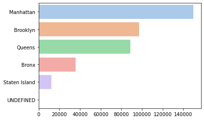

# Analyze NYC Inspections Dataset

## Abstract
The pupouse of this project is to show you what’s the most critical flag in New York City since 2014 untill 2021 followed by the highest critical
factors shown based on the outcome of the data where it will show the higher borough with critical flags. I worked with data provided by [the NYC Department of Health](https://data.cityofnewyork.us/Health/DOHMH-New-York-City-Restaurant-Inspection-Results/43nn-pn8j), 
    
## Design
This project originates from the [DrivenData competition](https://www.drivendata.org/competitions/7/pump-it-up-data-mining-the-water-table/) "Pump it Up: Data Mining the Water Table". The data is provided by [Taarifa](http://taarifa.org/) and the Tanzanian Ministry of Water, and presents a three-class operational status of **functional**, **functional needs repair**, and **non-functional** for waterpoints across the country. Classifying statuses accurately via machine learning models would enable the Tanzanian Ministry of Water to take action to improve operations and maintenance planning of these units, allocate resources more quickly to needed areas, and ensure potable water is accessible to as many people as possible.
datetime64[ns](2), float64(9), int64(1), object(14)
## Data
The dataset contains ~400,000 Boroughs with 26 features for each, 14 of which are categorical, 10 are numeric and 2 are dates. A highlights feature include  latitude/longitude coordinates.

## Algorithms

1. Mapping latitude and longitude to scatter mapbox
2. Converting categorical features to integers to count values of each category
3. Converting date features to string to have categorical column
4. Grouped by the boroughs to get score for each of them

<!-- *Models* -->
  

## Tools
- Pandas for data manipulation
- plotly and geopandas for mapping
- Matplotlib and Seaborn for plotting

## Visualization
- Plotly Map

- Plotly Map

